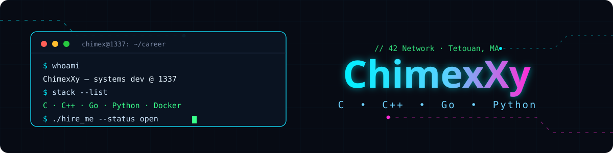

<div align="center">
  
</div>

---

### ⚡ About me

```text
Location  : Tetouan, Morocco 🇲🇦
School    : 1337 (42 Network)
Focus     : Low-level systems, networking, backend
```

### 🛠️ Tech Stack

<div align="center">


</div>

### 🚀 Featured Projects

| Project | What it is | Stack |
|---|---|---|
| **webserv** | Non-blocking HTTP/1.1 server — GET/POST/DELETE, CGI, custom config parser | `C++98` |
| **minishell** | A Bash-like shell — pipes, redirections, env, signals, builtins | `C` |
| **cub3d** | Raycasting 3D engine rendered from scratch (Wolfenstein-style) | `C` `miniLibX` |
| **philosophers** | Dining philosophers — multithreading, mutexes, deadlock-free design | `C` |
| **Inception** | Multi-service infra (NGINX · WordPress · MariaDB) in isolated containers | `Docker` |

### 📊 GitHub Stats

<div align="center">


</div>

### 🌐 Reach me

<div align="center">

[](https://www.linkedin.com/in/zahnoun-mouad-233966380/)
[](mailto:moadzahnoun37@gmail.com)

</div>

<div align="center">

</div>